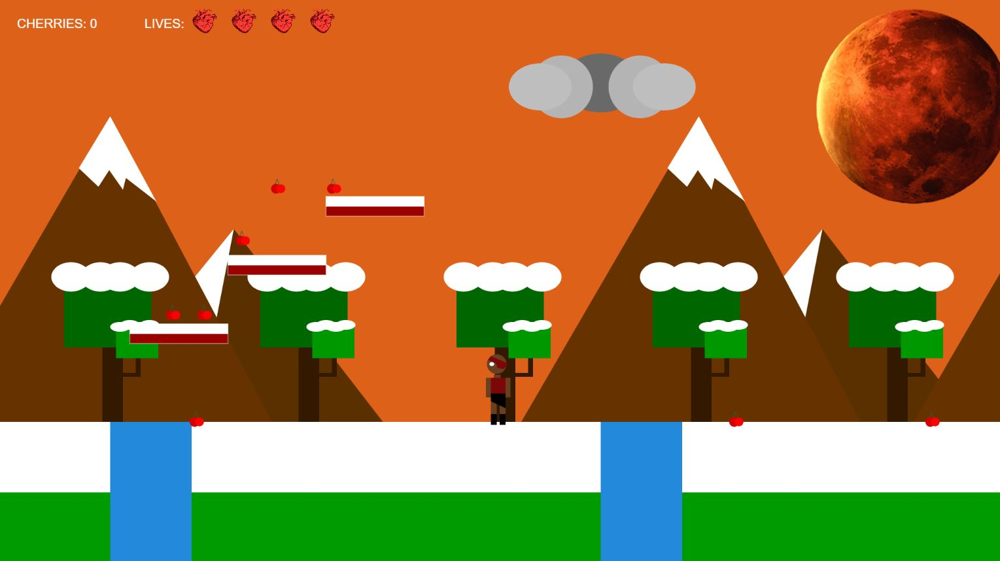
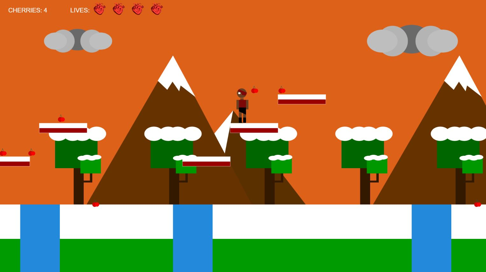

### The Game Project [YEAR 1 COMPUTER SCIENCE]

[BACKGROUND]
This is an interactive game using P5.js. 
This is the first game I created without any prior knowledge of coding. We first modelled our character, scenery, collectable items all from shapes.

[STORYLINE]
Our character lives on the planet Mercury in a dystopian future where the planet is getting closer and closer to Jupiter. 

The player must collect cherries to survive and raise the flag, so her teammates know that the collection is complete. The player has four lives as shown by the hearts on the top of the screen. The player can use the platforms to avoid the canyons and collect more cherries. 

If the player falls down the canyon, they will lose a life. Once the flag is raised, she will be able to leave with her collection of cherries.

