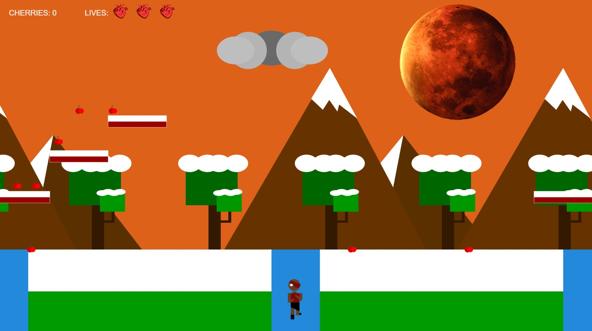

### The Game Project [YEAR 1 COMPUTER SCIENCE]

[BACKGROUND]
This is an interactive game using P5.js. 
This is the first game I created without any prior knowledge of coding. We first modelled our character, scenery, collectable items all from shapes.

[STORYLINE]
Our character lives on the planet Mercury in a dystopian future where the planet is getting closer and closer to Jupiter. 

[HOW TO PLAY]

Use the LEFT and RIGHT keys on your keyboard to move accordingly. Use SPACE to jump.

The player must collect cherries to survive and raise the flag, so their teammates know that the collection is complete. The player has four lives as shown by the hearts on the top of the screen. The player can use the platforms to avoid the canyons and collect more cherries. 

If the player falls down the canyon, they will lose a life and all their cherries. If the player falls down and loses all their lives, then its "GAME OVER" and they will have to start again.

There is a flagpole at the end of the map. When the player reaches the flag and raises it, they will be able to leave with their collection of cherries.

